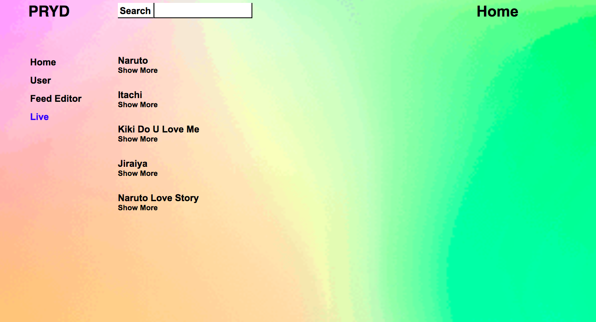

# Just like youtube, but better looking and built on React!

## PRYD is a video app that allows you to:
1. Search for videos
2. Watch videos 
3. Create different users
4. Edit your feed
 
## Breakdown of components:
* Nav Bar
* Search Bar
* Explore Page/Home Page
* Video Page
* User Page
* Feed Editor

## Instructions to use PRYD properly:
1. Clone this repo onto your local 
2. Run `npm install` 
3. Sign up for your own Youtube API, and it requires the following steps:
* **Create Project**: https://console.developers.google.com/projectcreate
* **Enable Youtube Data API v3**: https://console.developers.google.com/apis/library/youtube.googleapis.com
* **Create API Key**: https://console.developers.google.com/apis/credentials/wizard?api=youtube.googleapis.com 
4. Insert your API key in /Service/axios.js (line 17)
5. Have fun with it!

## Extra Resources:
* ReactWebCam: https://www.npmjs.com/package/react-webcam
* Loading.io: https://loading.io/
* GIPHY: https://giphy.com/explore/link

## Collaborators:
* @pampamelaabreu [Pam](https://www.linkedin.com/in/pamela-abreu)
* @Rupa1216 [Rupa](https://www.linkedin.com/in/sdatta87)
* @chuyunhuang [Yun](https://www.linkedin.com/in/chuyun-yun-huang)
* @DanielEduardoAshley)[Dan](https://www.linkedin.com/in/daniel-ashley-2907bb146)